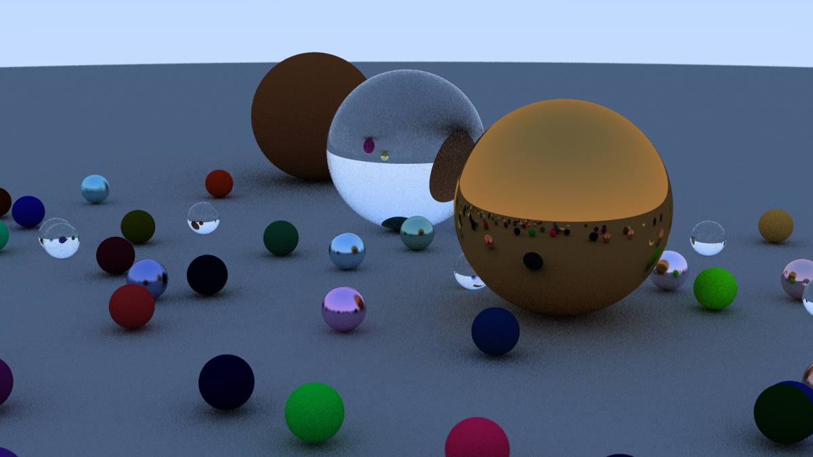
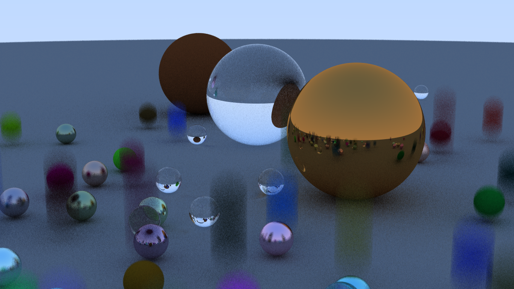

## cuda_rtracer

A CUDA-based ray tracer project.

###  Running in Docker with GPU Support

First, make sure you have Docker installed, your user is in the `docker` group, and the NVIDIA Container Toolkit is configured.  
Then build the Docker image from the included `Dockerfile`:

```bash
docker build -t cuda_img .
```

Run the container with GPU access and mount your project folder:

```bash
docker run --gpus all -it \
    -v /home/xichuz/workspace/cuda_rtracer:/mnt/workspace \
    -w /mnt/workspace \
    cuda_img bash
```

#### Render Example

Below is an example render generated by the project:



Motion Blur Example"



The size of the images is 1200×675 pixels.
